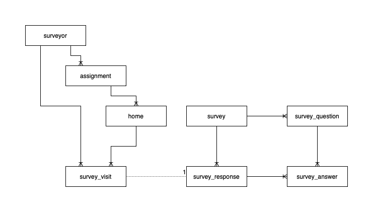

# Data Model

## Current

This shows the current data model for the heat pump accelerator backend.

Survey consist of a set of survey questions.

When a survey is administered, we create a survey response.
Each question that is answered has a survey answer,
which ties back both to the question and response object.

There is a home instance for all targeted homes.

When a surveyor goes to a home, we record a survey visit,
regardless of whether any survey was run
(e.g. due to the owner not being in).
This survey visit ties back to the surveyor and home.
If they were able to run the survey,
then the survey visit ties to the survey response,
and through that its answers.

## Possible future changes

We may want to model a “wish list”,
or a group of homes that may be visited by a surveyor,
which could require a new type.
This will require discussion with the stakeholders
to decide how this should work, e.g.:
* What is the intent of these lists? Are they:
  * A set of homes to be visited together
    (e.g. here are 10 homes on the same street,
    which would be convenient to visit one after another)?
    If so, is this assigned to a specific surveyor,
    or would this be the level that a surveyor could pick for future visits?
  * A set of homes that a surveyor builds,
    that they personally intend to visit?
    If so, should these homes (temporarily?) not be shown to other surveyors,
    so that they are not repeatedly visited by different people?
    If we did that, should the home be “released” from the list
    if it is not visited within a certain period of time?
* How should homes be assigned?
  If a home has been visited before,
  but the survey was finished,
  should we try to ensure that the same surveyor visits it again?
* How many concurrent surveys will there be?
  If this will always be one, that's fine.
  However, the current data model supports multiple.
  Would these need coordinating at all?
